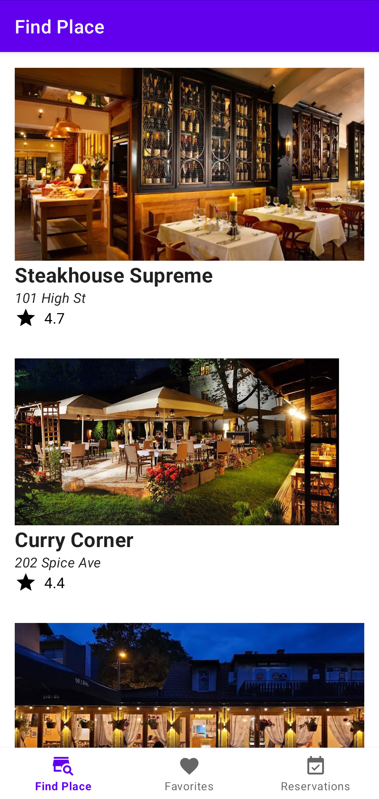
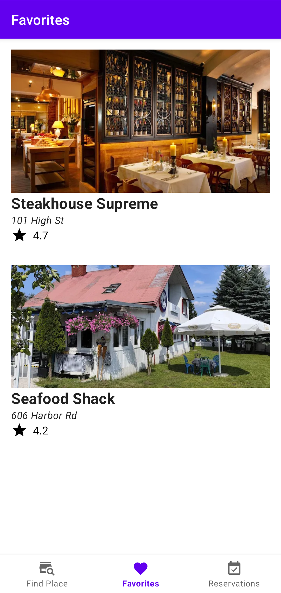
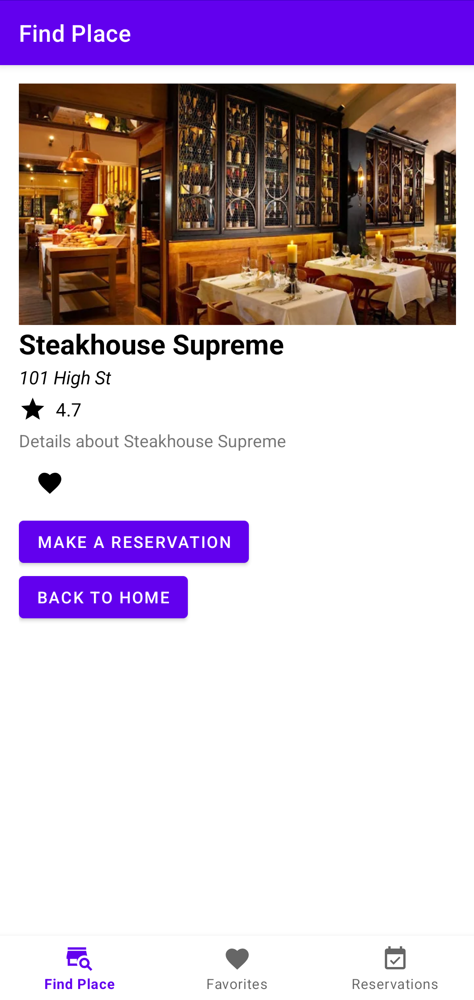
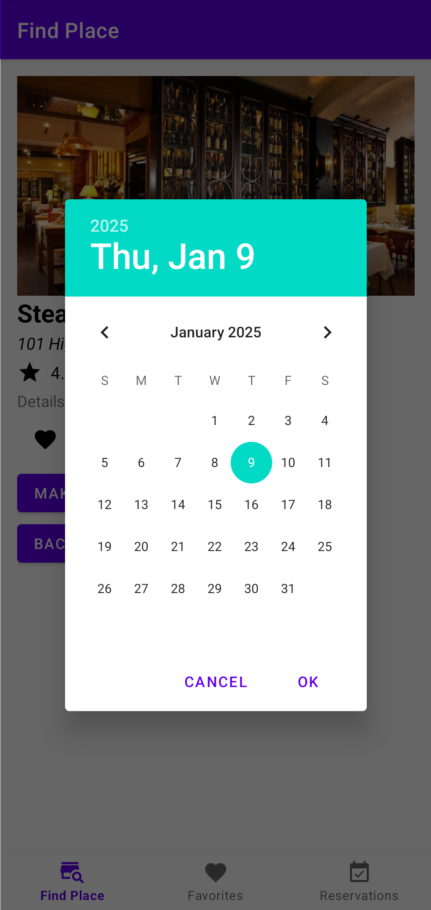
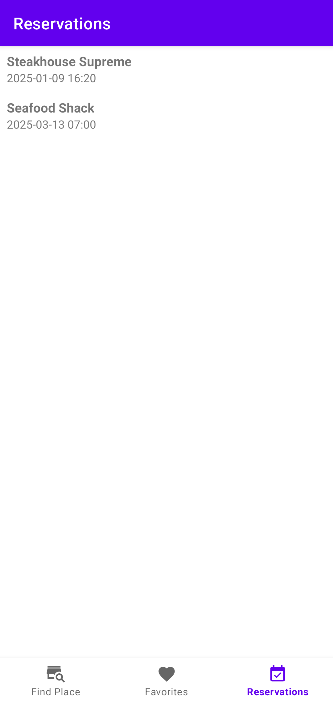

# Restaurant Reservation App

## Overview
This Android application allows users to browse restaurants, save favorites, and make reservations. The app features a modern, intuitive interface with three main tabs: restaurants list, favorites, and reservations.

## Features
- **Restaurant Discovery**: Browse through a curated list of restaurants with ratings and locations
- **Restaurant Details**: View detailed information about each restaurant
- **Favorites**: Save preferred restaurants for quick access
- **Reservations**: Make, view, and manage your restaurant reservations
- **Date & Time Selection**: Calendar interface for selecting reservation dates and times

## Screenshots

### Main Restaurant List

### Favourites

### Restaurant Details

### Reservation Calendar

### Reservations List

## Technical Implementation
This application was developed using Android Studio and follows modern Android development practices:

- Written in Java
- Constraint Layouts for responsive UI design
- Material Design principles
- Fragment-based navigation
- RecyclerView for efficient list rendering
- SharedPreferences for local data storage

## Setup and Installation
1. Clone the repository
2. Open the project in Android Studio (recommended version: latest stable)
3. Build and run the application on an emulator or physical device (minimum API level: 15)

## Project Structure
The application follows a standard Android project structure:
- `MainActivity.java`: Main entry point and container for fragments
- `RestaurantListFragment.java`: Displays the list of available restaurants
- `RestaurantDetailFragment.java`: Shows detailed information about a selected restaurant
- `FavoritesFragment.java`: Manages user's favorite restaurants
- `ReservationsFragment.java`: Handles reservation creation and management

## Future Enhancements
- Backend integration for real restaurant data
- User authentication
- Notifications for upcoming reservations
- Reviews and ratings system
- Online payment integration

## Acknowledgements
This project was created as part of a mobile application development course, based on instructions from the Android application development module (AOiM).